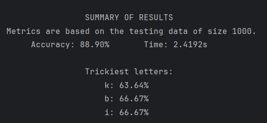
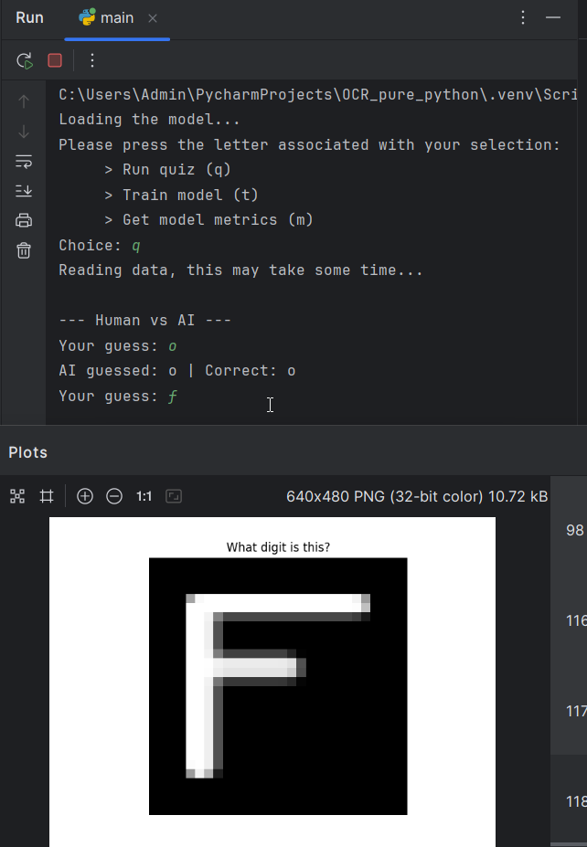

# 🧠 Handwritten Letter Recognition (A–Z)

A simple neural network built completely from scratch (no NumPy!) that learns to recognize **handwritten capital letters (A–Z)** using a custom `Matrix` class. It trains on a CSV dataset of pixel values and supports training, testing, and even a quiz mode where you try to beat the model.

---

## ✨ Features

- Feedforward neural network with one hidden layer
- Custom matrix math (dot product, softmax, ReLU, etc.)
- Batch training using stochastic gradient descent
- Softmax-based output across 26 letters
- Human vs AI quiz mode with visualized letters
- Accuracy breakdown + "trickiest letters" reporting

---

## ⚙️ Requirements

- Python 3.7+
- `matplotlib` (for quiz visuals)

Install with:

```bash
pip install matplotlib
```

---

## 📁 Project Structure

- `main.py` – Runs the program (training, testing, quiz)
- `matrix.py` – Custom matrix implementation
- `config.py` – Adjustable settings (epochs, batch size, etc.)
- `model.json` – Automatically saved trained model
- `A_Z Handwritten Data.csv` – Input dataset (Kaggle)
- `test_sample.csv` - Input dataset sample

---

## 🚀 How to Run

```bash
python main.py
```

You’ll be asked to choose a mode:

- `t` → Train the model  
- `m` → Get metrics + see which letters the model struggles with  
- `q` → Play a guessing game against the model

---

## 🧠 Model Info

- **Input layer**: 784 (28×28 pixel values)
- **Hidden layer**: Adjustable (default 26 neurons)
- **Output layer**: 26 (one per letter A–Z)
- **Activation**: ReLU + Softmax
- **Loss**: Categorical cross-entropy (via softmax derivative)

Edit `config.py` to tweak:
- `LEARNING_RATE`
- `BATCH_SIZE`
- `NUM_EPOCHS`
- `NEURON_COUNT`

---

## 📊 Example Metrics



---

## 🎮 Quiz Mode

The model will show you a handwritten letter. You guess it. The model guesses too. You get points for beating the AI.

Example:



---

## 📦 Dataset

Kaggle:  
**[A–Z Handwritten Letters in CSV Format](https://www.kaggle.com/datasets/sachinpatel21/az-handwritten-alphabets-in-csv-format)**

---
## 📌 Sources

- https://www.youtube.com/watch?v=w8yWXqWQYmU
- https://www.youtube.com/watch?v=tIeHLnjs5U8
